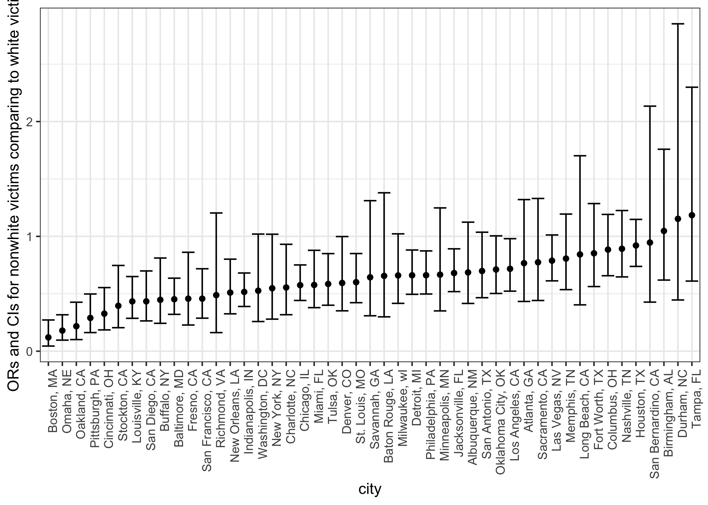

p8105\_hw6\_gw2383
================
Guojing Wu
11/23/2018

-   [Problem 1](#problem-1)
    -   [Tidy data](#tidy-data)
    -   [a logistic regression](#a-logistic-regression)
    -   [run `glm` for each of the cities](#run-glm-for-each-of-the-cities)
-   [Problem 2](#problem-2)
    -   [Load and clean the data](#load-and-clean-the-data)
    -   [Propose a regression model for birthweight](#propose-a-regression-model-for-birthweight)

Problem 1
---------

### Tidy data

``` r
homi_df = 
  read.csv("./data/problem1/homicide-data.csv") %>% 
  janitor::clean_names() %>% 
  filter(victim_race != "Unknown") %>% # delete unknown races
  mutate(city_state = paste(city, state, sep = ", "), 
         solved = ifelse(disposition == "Closed by arrest", 1, 0), # a binary indicator
         victim_race = ifelse(victim_race == "White", "White", "Nonwhite"), 
         victim_race = factor(victim_race, levels = c("White", "Nonwhite")), # a white / non white indicator
         victim_age = as.numeric(victim_age)) %>% 
  filter(!(city_state %in% c("Dallas, TX", "Phoenix, AZ", "Kansas City, MO", "Tulsa, AL"))) # filter cities
```

### a logistic regression

``` r
# first fit it
fit_logistic =
  homi_df %>% 
  glm(solved ~ victim_age + victim_sex + victim_race, data = ., family = binomial())

# then compute the odds ratio
fit_logistic %>% 
  broom::tidy(conf.int = T) %>% 
  mutate(OR = exp(estimate), 
         conf.low = exp(conf.low), 
         conf.high = exp(conf.high)) %>% 
  select(term, OR, conf.low, conf.high, p.value) %>% 
  filter(term %in% c("(Intercept)", "victim_raceNonwhite")) %>% 
  knitr::kable()
```

| term                 |         OR|   conf.low|  conf.high|  p.value|
|:---------------------|----------:|----------:|----------:|--------:|
| (Intercept)          |  2.2088105|  2.0425960|  2.3891523|        0|
| victim\_raceNonwhite |  0.5848341|  0.5528333|  0.6185851|        0|

### run `glm` for each of the cities

``` r
nest_glm_res = 
  homi_df %>% 
  group_by(city_state) %>% 
  nest() %>% 
  mutate(models = map(data, ~glm(solved ~ victim_race + victim_age + victim_sex, data = .x, family = binomial())), 
         models_esti = map(models, broom::tidy), # tidying for estimate
         models_conf = map(models, broom::confint_tidy)) %>% # tyding for conf.int
  select(-data, -models) %>%
  unnest() %>% 
  filter(term %in% c("(Intercept)", "victim_raceNonwhite")) %>% 
  mutate(OR = exp(estimate), 
         conf.low = exp(conf.low), 
         conf.high = exp(conf.high)) %>% 
  select(city_state, term, OR, conf.low, conf.high, p.value)

nest_glm_res
```

    ## # A tibble: 94 x 6
    ##    city_state      term                   OR conf.low conf.high    p.value
    ##    <chr>           <chr>               <dbl>    <dbl>     <dbl>      <dbl>
    ##  1 Albuquerque, NM (Intercept)         2.88     1.41      6.05  0.00434   
    ##  2 Albuquerque, NM victim_raceNonwhite 0.723    0.438     1.19  0.201     
    ##  3 Atlanta, GA     (Intercept)         2.89     1.47      5.81  0.00236   
    ##  4 Atlanta, GA     victim_raceNonwhite 0.767    0.433     1.32  0.348     
    ##  5 Baltimore, MD   (Intercept)         2.85     1.84      4.47  0.00000378
    ##  6 Baltimore, MD   victim_raceNonwhite 0.453    0.321     0.636 0.00000533
    ##  7 Baton Rouge, LA (Intercept)         4.39     1.73     11.9   0.00252   
    ##  8 Baton Rouge, LA victim_raceNonwhite 0.656    0.299     1.38  0.275     
    ##  9 Birmingham, AL  (Intercept)         1.80     0.917     3.58  0.0891    
    ## 10 Birmingham, AL  victim_raceNonwhite 1.06     0.624     1.77  0.840     
    ## # ... with 84 more rows

Then create a plot that shows the estimated ORs and CIs for each city, and comment on the plot.

``` r
nest_glm_res %>% 
  filter(term == "victim_raceNonwhite") %>% 
  ggplot(aes(x = reorder(city_state, OR), y = OR)) +
  geom_point() +
  geom_errorbar(aes(ymin = conf.low, ymax = conf.high)) +
  labs(x = "city", 
       y = "ORs and CIs for nonwhite victims comparing to white victims") + 
  theme(axis.text.x = element_text(angle = 90, hjust = 1))
```



According to this plot, we can see that across every cities, non white victims tend to have more unsolved homicides comparing to white victims (with `Boston, MA` has the least extra unsolved and `Tampa, FL` has the most extra unsolved).

Problem 2
---------

### Load and clean the data

``` r
bw_df = 
  read.csv("./data/problem2/birthweight.csv") %>% 
  as.tibble() %>% 
  janitor::clean_names() %>% 
  select(bwt, everything())
```

-   We first checked if there is `NA` in this dataset, and found out that there are 0 `NA`s.

-   Second we check the collinearity:

``` r
bw_df %>% 
  cor() %>% 
  knitr::kable()
```

|          |         bwt|     babysex|       bhead|     blength|       delwt|     fincome|       frace|     gaweeks|     malform|    menarche|     mheight|      momage|       mrace|      parity|  pnumlbw|  pnumsga|       ppbmi|        ppwt|      smoken|      wtgain|
|----------|-----------:|-----------:|-----------:|-----------:|-----------:|-----------:|-----------:|-----------:|-----------:|-----------:|-----------:|-----------:|-----------:|-----------:|--------:|--------:|-----------:|-----------:|-----------:|-----------:|
| bwt      |   1.0000000|  -0.0866418|   0.7471068|   0.7434508|   0.2878893|   0.1545715|  -0.1793900|   0.4121833|   0.0013332|  -0.0244247|   0.1921632|   0.1357734|  -0.2076689|  -0.0083741|       NA|       NA|   0.0939457|   0.1828920|  -0.0756278|   0.2472526|
| babysex  |  -0.0866418|   1.0000000|  -0.1688005|  -0.1052882|  -0.0164194|  -0.0226430|   0.0309277|   0.0202404|  -0.0180325|  -0.0062865|   0.0077359|  -0.0371782|   0.0360213|   0.0229980|       NA|       NA|  -0.0069938|  -0.0010070|  -0.0277543|  -0.0314619|
| bhead    |   0.7471068|  -0.1688005|   1.0000000|   0.6304548|   0.2143707|   0.1156991|  -0.0960801|   0.3784565|   0.0029970|  -0.0030161|   0.1169482|   0.1080813|  -0.1101420|  -0.0200395|       NA|       NA|   0.0865565|   0.1366088|  -0.0539472|   0.1833337|
| blength  |   0.7434508|  -0.1052882|   0.6304548|   1.0000000|   0.2291494|   0.0787451|  -0.1133571|   0.3592637|  -0.0090215|  -0.0210674|   0.1602598|   0.0801603|  -0.1324835|  -0.0324701|       NA|       NA|   0.0740158|   0.1486046|  -0.0656288|   0.1912238|
| delwt    |   0.2878893|  -0.0164194|   0.2143707|   0.2291494|   1.0000000|   0.0349944|  -0.0648496|   0.1242785|   0.0120943|  -0.0859401|   0.4112576|   0.0740409|  -0.0922383|  -0.0047091|       NA|       NA|   0.7205041|   0.8709133|   0.0486127|   0.4247883|
| fincome  |   0.1545715|  -0.0226430|   0.1156991|   0.0787451|   0.0349944|   1.0000000|  -0.2845921|   0.1066777|  -0.0068882|  -0.0035351|   0.1310186|   0.3231142|  -0.3048117|  -0.0259424|       NA|       NA|  -0.0201890|   0.0472526|   0.0779430|  -0.0160377|
| frace    |  -0.1793900|   0.0309277|  -0.0960801|  -0.1133571|  -0.0648496|  -0.2845921|   1.0000000|  -0.1137273|  -0.0268645|   0.0212101|  -0.2008713|  -0.1869341|   0.8286055|   0.0011767|       NA|       NA|   0.0459474|  -0.0596140|  -0.1729336|  -0.0217712|
| gaweeks  |   0.4121833|   0.0202404|   0.3784565|   0.3592637|   0.1242785|   0.1066777|  -0.1137273|   1.0000000|  -0.0050945|  -0.0004363|   0.0621377|   0.1139098|  -0.1315206|  -0.0796589|       NA|       NA|   0.0273359|   0.0564730|   0.0362117|   0.1481460|
| malform  |   0.0013332|  -0.0180325|   0.0029970|  -0.0090215|   0.0120943|  -0.0068882|  -0.0268645|  -0.0050945|   1.0000000|  -0.0098673|  -0.0079746|   0.0177281|  -0.0276627|  -0.0013178|       NA|       NA|   0.0002545|  -0.0033799|   0.0331603|   0.0307670|
| menarche |  -0.0244247|  -0.0062865|  -0.0030161|  -0.0210674|  -0.0859401|  -0.0035351|   0.0212101|  -0.0004363|  -0.0098673|   1.0000000|   0.0741156|   0.1760380|   0.0134218|   0.0194762|       NA|       NA|  -0.1218261|  -0.0704996|   0.0163746|  -0.0445137|
| mheight  |   0.1921632|   0.0077359|   0.1169482|   0.1602598|   0.4112576|   0.1310186|  -0.2008713|   0.0621377|  -0.0079746|   0.0741156|   1.0000000|   0.1090480|  -0.2304254|  -0.0134237|       NA|       NA|  -0.1007377|   0.4266872|   0.0609835|   0.0484789|
| momage   |   0.1357734|  -0.0371782|   0.1080813|   0.0801603|   0.0740409|   0.3231142|  -0.1869341|   0.1139098|   0.0177281|   0.1760380|   0.1090480|   1.0000000|  -0.2116000|   0.0519542|       NA|       NA|   0.0812451|   0.1295921|   0.0754544|  -0.0884876|
| mrace    |  -0.2076689|   0.0360213|  -0.1101420|  -0.1324835|  -0.0922383|  -0.3048117|   0.8286055|  -0.1315206|  -0.0276627|   0.0134218|  -0.2304254|  -0.2116000|   1.0000000|   0.0021177|       NA|       NA|   0.0348432|  -0.0842482|  -0.1975179|  -0.0319667|
| parity   |  -0.0083741|   0.0229980|  -0.0200395|  -0.0324701|  -0.0047091|  -0.0259424|   0.0011767|  -0.0796589|  -0.0013178|   0.0194762|  -0.0134237|   0.0519542|   0.0021177|   1.0000000|       NA|       NA|  -0.0059267|  -0.0112029|  -0.0055757|   0.0110819|
| pnumlbw  |          NA|          NA|          NA|          NA|          NA|          NA|          NA|          NA|          NA|          NA|          NA|          NA|          NA|          NA|        1|       NA|          NA|          NA|          NA|          NA|
| pnumsga  |          NA|          NA|          NA|          NA|          NA|          NA|          NA|          NA|          NA|          NA|          NA|          NA|          NA|          NA|       NA|        1|          NA|          NA|          NA|          NA|
| ppbmi    |   0.0939457|  -0.0069938|   0.0865565|   0.0740158|   0.7205041|  -0.0201890|   0.0459474|   0.0273359|   0.0002545|  -0.1218261|  -0.1007377|   0.0812451|   0.0348432|  -0.0059267|       NA|       NA|   1.0000000|   0.8533168|   0.0070230|  -0.1099296|
| ppwt     |   0.1828920|  -0.0010070|   0.1366088|   0.1486046|   0.8709133|   0.0472526|  -0.0596140|   0.0564730|  -0.0033799|  -0.0704996|   0.4266872|   0.1295921|  -0.0842482|  -0.0112029|       NA|       NA|   0.8533168|   1.0000000|   0.0388547|  -0.0749403|
| smoken   |  -0.0756278|  -0.0277543|  -0.0539472|  -0.0656288|   0.0486127|   0.0779430|  -0.1729336|   0.0362117|   0.0331603|   0.0163746|   0.0609835|   0.0754544|  -0.1975179|  -0.0055757|       NA|       NA|   0.0070230|   0.0388547|   1.0000000|   0.0270658|
| wtgain   |   0.2472526|  -0.0314619|   0.1833337|   0.1912238|   0.4247883|  -0.0160377|  -0.0217712|   0.1481460|   0.0307670|  -0.0445137|   0.0484789|  -0.0884876|  -0.0319667|   0.0110819|       NA|       NA|  -0.1099296|  -0.0749403|   0.0270658|   1.0000000|

We saw that the standard deviation for `pnumlbw` and `pnumsga` is 0, so we checked these two variables and found out that their sum is 0 and 0, which suggest that all the values in these two columns are 0s, so we need to remove these two columns.

We also saw that cor(`ppwt`, `delwt`), cor(`ppwt`, `ppbmi`) and cor(`frace`, `mrace`) are ≥0.8. In these case, we remove the `ppwt` and `frace` columns since mother race is more related to child and BMI is more representative than body weight. Then we change some variable to factors:

``` r
bw_df =
  bw_df %>% 
  select(-pnumlbw, -pnumsga, -ppwt, -frace) %>% 
  mutate(babysex = factor(babysex),
         malform = factor(malform),
         mrace = factor(mrace, levels = c(1, 2, 3, 4, 8)))
```

### Propose a regression model for birthweight

``` r
bw_df %>% 
  regsubsets(bwt ~ ., data = .) %>% 
  summary()
```

    ## Warning in leaps.setup(x, y, wt = wt, nbest = nbest, nvmax = nvmax,
    ## force.in = force.in, : 1 linear dependencies found

    ## Reordering variables and trying again:

    ## Subset selection object
    ## Call: function_list[[i]](value)
    ## 18 Variables  (and intercept)
    ##          Forced in Forced out
    ## babysex2     FALSE      FALSE
    ## bhead        FALSE      FALSE
    ## blength      FALSE      FALSE
    ## delwt        FALSE      FALSE
    ## fincome      FALSE      FALSE
    ## gaweeks      FALSE      FALSE
    ## malform1     FALSE      FALSE
    ## menarche     FALSE      FALSE
    ## mheight      FALSE      FALSE
    ## momage       FALSE      FALSE
    ## mrace2       FALSE      FALSE
    ## mrace3       FALSE      FALSE
    ## mrace4       FALSE      FALSE
    ## parity       FALSE      FALSE
    ## ppbmi        FALSE      FALSE
    ## smoken       FALSE      FALSE
    ## wtgain       FALSE      FALSE
    ## mrace8       FALSE      FALSE
    ## 1 subsets of each size up to 9
    ## Selection Algorithm: exhaustive
    ##          babysex2 bhead blength delwt fincome gaweeks malform1 menarche
    ## 1  ( 1 ) " "      "*"   " "     " "   " "     " "     " "      " "     
    ## 2  ( 1 ) " "      "*"   "*"     " "   " "     " "     " "      " "     
    ## 3  ( 1 ) " "      "*"   "*"     " "   " "     " "     " "      " "     
    ## 4  ( 1 ) " "      "*"   "*"     "*"   " "     " "     " "      " "     
    ## 5  ( 1 ) " "      "*"   "*"     "*"   " "     "*"     " "      " "     
    ## 6  ( 1 ) " "      "*"   "*"     "*"   " "     "*"     " "      " "     
    ## 7  ( 1 ) " "      "*"   "*"     "*"   " "     "*"     " "      " "     
    ## 8  ( 1 ) " "      "*"   "*"     "*"   " "     "*"     " "      " "     
    ## 9  ( 1 ) "*"      "*"   "*"     "*"   " "     "*"     " "      " "     
    ##          mheight momage mrace2 mrace3 mrace4 mrace8 parity ppbmi smoken
    ## 1  ( 1 ) " "     " "    " "    " "    " "    " "    " "    " "   " "   
    ## 2  ( 1 ) " "     " "    " "    " "    " "    " "    " "    " "   " "   
    ## 3  ( 1 ) " "     " "    "*"    " "    " "    " "    " "    " "   " "   
    ## 4  ( 1 ) " "     " "    "*"    " "    " "    " "    " "    " "   " "   
    ## 5  ( 1 ) " "     " "    "*"    " "    " "    " "    " "    " "   " "   
    ## 6  ( 1 ) " "     " "    "*"    " "    " "    " "    " "    " "   "*"   
    ## 7  ( 1 ) " "     " "    "*"    " "    " "    " "    " "    "*"   "*"   
    ## 8  ( 1 ) " "     " "    "*"    " "    "*"    " "    " "    "*"   "*"   
    ## 9  ( 1 ) " "     " "    "*"    " "    "*"    " "    " "    "*"   "*"   
    ##          wtgain
    ## 1  ( 1 ) " "   
    ## 2  ( 1 ) " "   
    ## 3  ( 1 ) " "   
    ## 4  ( 1 ) " "   
    ## 5  ( 1 ) " "   
    ## 6  ( 1 ) " "   
    ## 7  ( 1 ) " "   
    ## 8  ( 1 ) " "   
    ## 9  ( 1 ) " "
